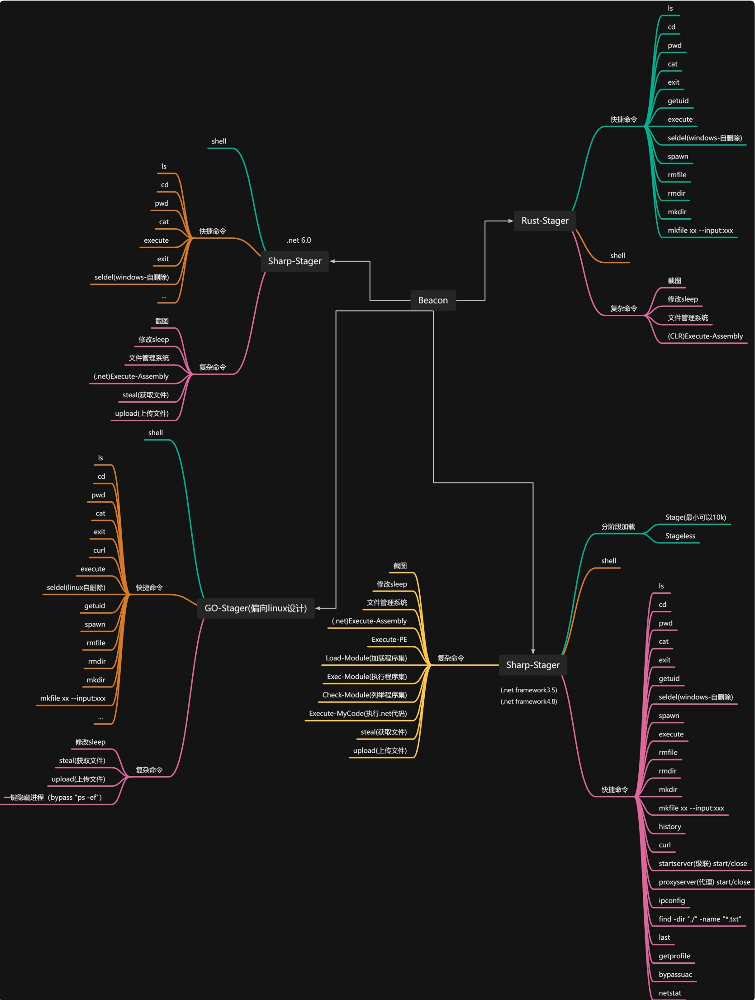

## 目前支持的Beacon类型

## 主要功能
- 不开源，内部团队使用，适用于授权范围内的红蓝演练，攻防对抗，钓鱼等合法途径。
- 信标使用多套语言生成（意味着你可以针对你擅长的语言进行二开，或者你觉得存在非行为特征暴露了就切换另一套）（使用rust是为了解决底层调用的安全性和高效性、使用golang是为了解决Linux跨平台、使用C++是为了Rootkit...），包括但不限于Rust、Golang、C/C++、C#。
- 支持Stager（10~20k）分阶段加载和Stagerless无阶段加载
- 支持EXE生成、shellcode生成/dll生成等x64/x86架构的随机化生成、自毁式（过卡巴）的信标（Linux需要手动安装如Golang等编译器）；支持插件（目前提供inline-ExecutePE、Execute-Assembly、beaconinit和shell命令）；支持动态Profile（使用Burpsuite样式来直观看到你的Profile）
- 常规：文件上传下载（可以指定GET/POST，不限于大文件）、创建/删除、Execute等
- 白+黑：支持白+黑管理，自动化搜集本地可以使用的白程序，并且支持可视化界面管理（主动分析等）
- Windows：支持级联(不出外网机器也可以上线)、RDI、sRDI、Execute-Assembly、Inline-Assembly、Inline-ExecutePE、BOF、shellcode注入、文件管理系统、截图、键盘记录和窗口栏记录，使用模拟点击来仿制RDP等
- Linux：支持一键隐藏进程、Inline-Assembly、Execute-Assembly
- 内置命令列表：getuid、curl、find、ps、cat、cd、history、pwd、ipconfig、netstat多种命令。

## 视频演示

[demo](https://github.com/joker-xiaoyan/Cat2d0g/blob/main/C2-demo.mp4)
